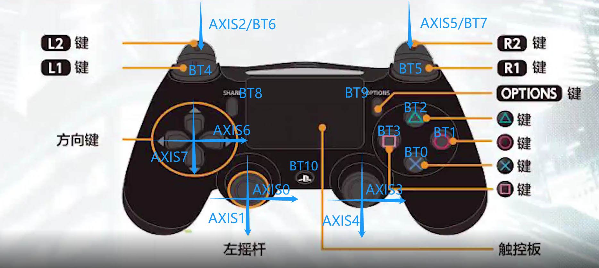

## 按键说明

1. 按键映射对照图片： 
2. 其中AXIS为线性按键，箭头方向为正方向，值范围:-32767 - 32767，除扳机键L2/R2外初始值均为0  
3. 其中BT为常规按键，按下为1，松开为0
4. 方向键属于线性按键，但只有两个值，图示AXIS两端的键分别为最小和最大
5. L2/R2扳机键初始值为-32767，按下后线性增加到最大值，同时扳机键是一个复合按键，按下后同时触发一个常规按键，复合关系看图

