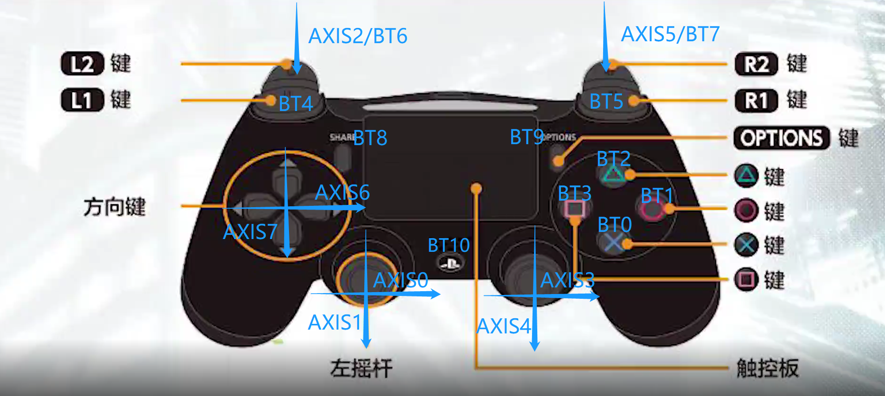

## 按键说明

1. 按键映射对照图片： 
2. 其中AXIS为线性按键，箭头方向为正方向，值范围:-32767 - 32767，除扳机键L2/R2外初始值均为0  
3. 其中BT为常规按键，按下为1，松开为0
4. 方向键属于线性按键，但只有两个值，图示AXIS两端的键分别为最小和最大
5. L2/R2扳机键初始值为-32767，按下后线性增加到最大值，同时扳机键是一个复合按键，按下后同时触发一个常规按键，复合关系看图

## 吊挂组合测试

- 单独按 X：翻转 `MotionCommands.btn_9`，用于跑步轨迹启动/停止；
- 单独按 Y：翻转 `MotionCommands.btn_10`，用于振动预检、振动启动/停止；
- 单独按 A：翻转 `MotionCommands.btn_7`，依次测试手臂、躯干和腿部关节；
- 固定编号为 A=0、B=1、X=3、Y=4；旧 LB/RB 组合功能已禁用；
- Start（`jstest` 按钮 11）是软件急停入口：先停止硬件驱动，再由 launch 统一
  关闭控制器和手柄节点，避免重复 SIGINT；不会启动 demo、BMS 或其他控制程序。
